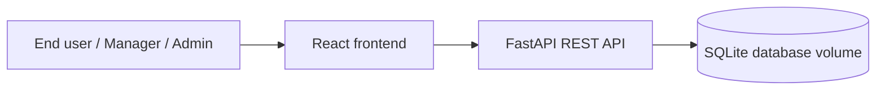

# Architecture

## Authorization model

- User: can read own profile, catalog, own orders, create requests, return own approved/delivered services.
- Manager: can also view and approve/reject team orders; privacy notes are hidden.
- Admin: can view users and all orders.

## First Time Right rules implemented

- Unique-name services reject missing or duplicate names before creation.
- DWO virtual workplace services require that the requester has DWO Basis.
- Hardware and accessories require delivery method and accepted user agreement.
- Services with tariff >= €300 enter manager approval status.
